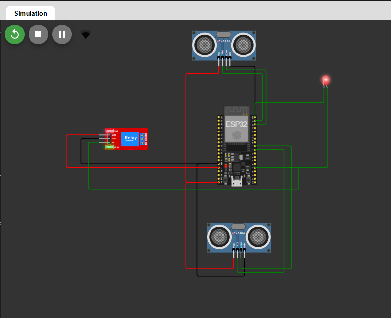
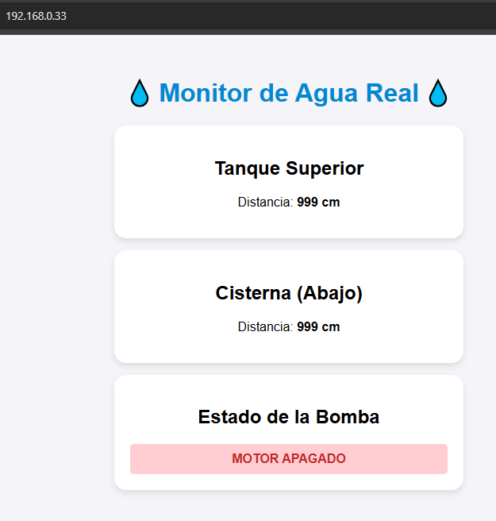
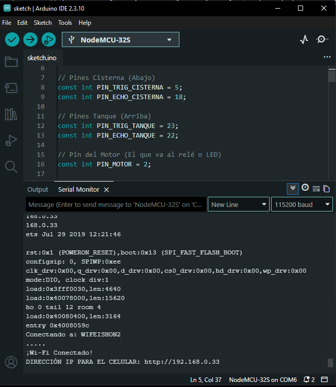

# Tanque_Cisterna_Web_Control_ESP32
Con una esp32 dos sensores ultrasonicos y un relay manejamos el motor de una bomba y vemos el estado del tanque en tiempo real en un servidor web hosteado en la misma ESP32

Setup

Una ESP32 yo use una NodeMCU 32S creo...
Dos sendores ultrasonicos para la cisterna y el tanque
Un relay de 5v 10amp 220v o la tension que manejen en su lugar

Conectan la ESP32 al usb o lo que sea que usen para comunicarse
Instalan abren Arduino IDE y los drivers que necesiten (la IA es su amiga)

Pegan el codigo, prueban si da ok lo suben / compilan a la ESP32

Muy importante antes de editar su wifi 

// ⚠️ CAMBIA ESTO CON LOS DATOS DE TU CASA ⚠️
const char* ssid = "EL_NOMBRE_DE_TU_WIFI";
const char* password = "TU_CONTRASEÑA_DEL_WIFI";

Una vez compilado en la ESP32 te da la ip para conectarte, lo normal es que la asigne el dhcp de tu router

El projecto se encuentra simulado en wolwi

https://wokwi.com/projects/467575637641711617

Codifico: Gemini
Guia espiritual: Yim

Just coding 4 fun !!!

https://gemini.google.com/app/cda3b56294498d7e

