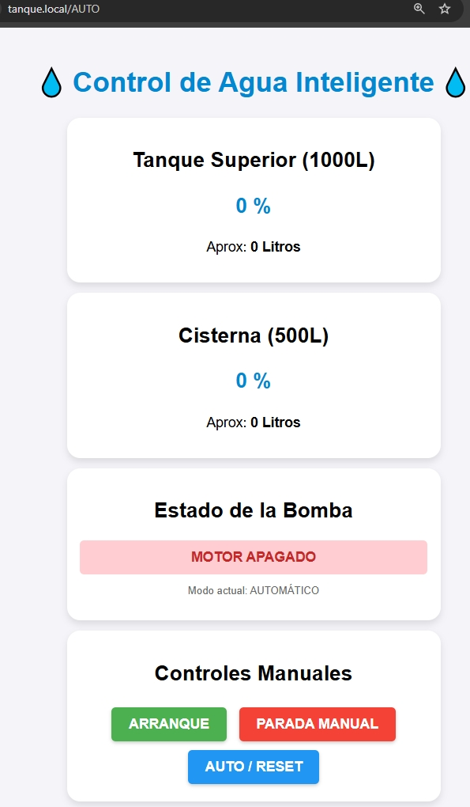
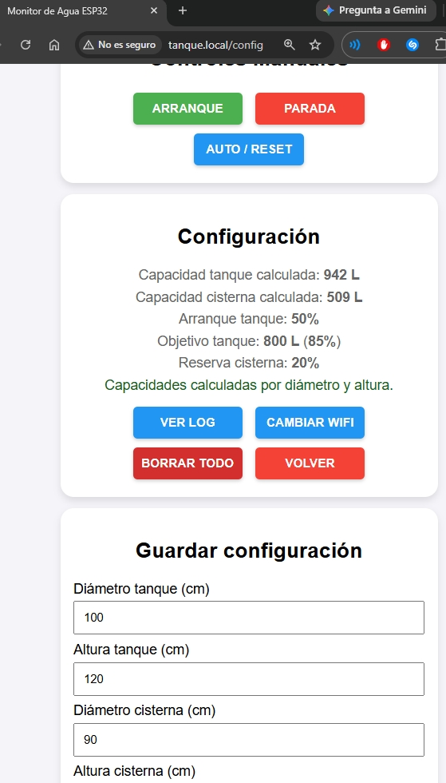
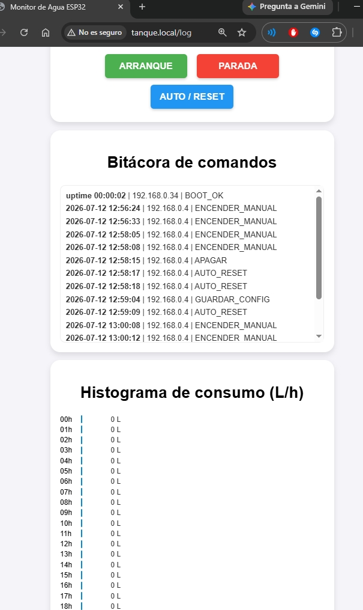

# Control de bomba para tanque con cisterna por ESP32

Proyecto para controlar una bomba con una ESP32, dos sensores ultrasónicos y un relé. El sistema publica una interfaz web en la propia placa para ver el estado del tanque y la cisterna, habilitar control manual, cambiar el WiFi y acceder por IP o por mDNS.

## Qué incluye

- Servidor web local en la ESP32.
- Medición de cisterna y tanque en tiempo real.
- Modo automático con lógica de llenado.
- Arranque manual con modal de confirmación.
- Arranque manual directo del relé (independiente de niveles), con corte por tiempo máximo.
- Cambio de credenciales WiFi desde ruta oculta de configuración.
- Ruta `/log` con bitácora de acciones (IP, fecha/hora cuando hay NTP).
- Histograma de consumo de agua estimado por hora.
- Acceso por IP local y por `http://tanque.local/`.

## Materiales

- 1 ESP32 compatible, por ejemplo NodeMCU 32S.
- 2 sensores ultrasónicos.
- 1 relé para la bomba.
- Fuente y cableado adecuados para tu instalación.

## Requisitos

1. Instala y abre **[Arduino IDE](https://docs.arduino.cc/software/ide/)**.
2. Configura el soporte de ESP32 en el IDE.
3. Si tu placa no comunica, instala el driver correcto, por ejemplo **[WCH CH340 Driver](https://www.tecneu.com/blogs/tutoriales-de-electronica/guia-paso-a-paso-para-instalar-el-driver-ch340g-en-windows-y-mac?srsltid=AfmBOorWYHYStt433QoR3n1FMt2kGe9WqyiUDfcd9x9y8EoXX6WNAXF_)** o **[Silicon Labs CP210x](https://community.silabs.com/s/question/0D58Y00008K88dCSAR/how-to-download-cp210x-usb-to-uart-bridge-vcp-drivers?language=es)**.
4. Asegúrate de tener las librerías necesarias para ESP32 y WiFiManager.

## Uso

1. Abre el proyecto en Arduino IDE.
2. Compila y sube el sketch que está en [sketch/sketch.ino](sketch/sketch.ino).
3. La primera vez, la ESP32 abrirá el portal de WiFiManager para conectar a tu red.
4. Una vez conectada, revisa el monitor serie: ahí verás la IP local y la URL de acceso.
5. También puedes entrar desde la web con la IP mostrada o con `http://tanque.local/` si tu red resuelve mDNS.

## Prueba rápida

- En el simulador de Wokwi puedes probar la lógica y mover los sensores.
- Proyecto de referencia: https://wokwi.com/projects/467575637641711617

## Nota sobre red

La interfaz web ya no depende de editar manualmente `ssid` y `password`. La red se gestiona con WiFiManager.

Para cambiar credenciales guardadas, entra a la ruta oculta `http://tanque.local/config` (o `http://IP_LOCAL/config`) y usa la opción **CAMBIAR WIFI**.

En esa misma pantalla también puedes guardar la configuración de control del sistema:

- Diámetro y altura de tanque y cisterna.
- Caudal de la bomba en L/min.
- Distancia de lleno y vacío para tanque y cisterna.
- Distancia actual medida por cada sensor.

El sketch calcula la capacidad de cada depósito a partir de diámetro y altura, y usa la calibración de distancias para determinar los arranques y paradas.

En esa misma ruta `/config` tienes el acceso a **VER LOG**, que abre `http://tanque.local/log`.

La conexión queda en DHCP por defecto para que el autoconectado sea más estable, pero ahora también puedes cargar IP manual desde el mismo portal.

### Modo simultáneo: DHCP + IP manual

En el portal de WiFiManager verás los campos de IP, gateway, máscara y DNS.

1. Si dejas esos campos vacíos, la ESP32 conecta por DHCP (automático).
2. Si completas esos campos, la ESP32 conecta con IP manual (estática).

### Opcional avanzado: IP manual por código

Si prefieres dejar fija la IP desde el código, el sketch también está preparado con un ejemplo.

1. Abre [sketch/sketch.ino](sketch/sketch.ino).
2. Busca el bloque `CONFIGURACIÓN DE IP MANUAL (ESTÁTICA)`.
3. Descomenta estas 4 líneas y ajusta los valores a tu red:
	- `IP_MANUAL(192, 168, 0, 34)`
	- `GW_MANUAL(192, 168, 0, 1)`
	- `MASK_MANUAL(255, 255, 255, 0)`
	- `DNS_MANUAL(8, 8, 8, 8)`
4. En `setup()`, descomenta esta línea:
	- `wifiManager.setSTAStaticIPConfig(IP_MANUAL, GW_MANUAL, MASK_MANUAL, DNS_MANUAL);`
5. Compila y vuelve a subir el sketch.

Si dejas todo comentado, seguirá usando el modo simultáneo del portal (DHCP por defecto con opción manual).

## Control manual y seguridad

1. El botón **ARRANQUE** muestra un modal de advertencia antes de activar el relé.
2. Al confirmar, el relé puede encender en modo manual directo (salta la lógica automática de niveles).
3. El botón **PARADA** corta el relé manual.
4. El botón **AUTO / RESET** vuelve al modo automático.
5. El límite de seguridad de 10 minutos sigue activo incluso en modo manual directo.

## Logs y consumo

1. Entra a `http://tanque.local/config`.
2. Abre **VER LOG** para ir a `http://tanque.local/log`.
3. Allí verás la bitácora de comandos con acción, IP cliente y marca de tiempo.
4. También verás un histograma de consumo estimado (L/h), calculado por variación del tanque.
5. Si no hay hora sincronizada por red, la marca de tiempo se guarda como uptime.

## Primera conexión

1. Conéctate desde el celular o PC a la red WiFi que levanta la ESP32 (portal de WiFiManager).
2. Elige tu red WiFi de casa y escribe la contraseña.
3. Guarda y sal del portal. La red temporal de la ESP32 se cierra.
4. Vuelve a conectarte a tu red normal y entra a `http://tanque.local` o a la IP mostrada por el monitor serie.

